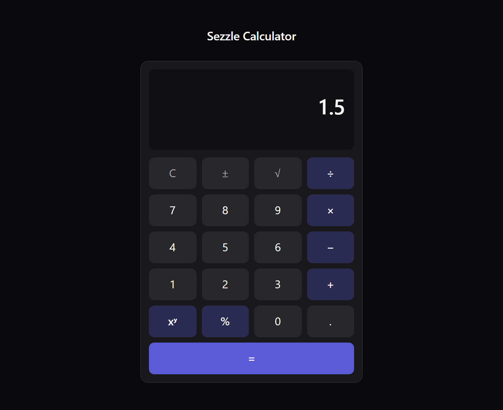

# Sezzle Calculator

A full-stack calculator: a Go API that owns the arithmetic, and a React client
that renders it. The backend uses the Go standard library only, with no web
framework.

## Overview

Seven operations (add, subtract, multiply, divide, power, square root,
percentage) are exposed as HTTP endpoints. The browser never computes anything:
every key press that produces a result becomes a request, and the server is the
single source of truth for both the arithmetic and its validation.



The client keeps its own input validation (one decimal point, a 15 character
display, both operands present before sending), but only to make the interface
feel responsive. Nothing the client accepts is trusted by the server.

## Tech stack

| Choice | Why |
|---|---|
| **Go 1.23, standard library only** | `net/http` covers routing, middleware and JSON without a framework; see [Design decisions](#design-decisions). |
| **`http.ServeMux` (Go 1.22+)** | Method patterns (`POST /api/v1/add`) removed the last reason to reach for a third-party router. |
| **React 19 + TypeScript 6** | Discriminated unions make an unhandled API error a compile error rather than a runtime one. |
| **Vite 8** | Instant dev server, and a dev proxy that removes CORS from the local loop entirely. |
| **Plain CSS with custom properties** | The UI is one component tree; a utility framework would add a build step and a dependency for about 250 lines of CSS. |
| **Vitest 5 + Testing Library** | Shares the Vite config and transform pipeline, so there is no second build setup to maintain. |
| **oxlint** | Ships with the current Vite React template and runs in a fraction of the time ESLint takes. |
| **Docker multi-stage + nginx** | Ships a 19.9 MB API image with no compiler in it, and serves the built client from a static server rather than a Node process. |

## Project structure

```
.
├── Makefile                        # test, coverage, run and docker targets
├── docker-compose.yml              # both services, one network, healthcheck gating
├── backend/
│   ├── Dockerfile                  # multi-stage: golang:1.23-alpine -> alpine:3.20
│   ├── go.mod                      # no dependencies
│   ├── cmd/server/main.go          # entry point: config, timeouts, graceful shutdown
│   └── internal/
│       ├── calculator/             # pure arithmetic, imports only errors and math
│       │   ├── calculator.go       # the seven operations and their sentinel errors
│       │   └── calculator_test.go  # table-driven, 72 subtests
│       └── api/                    # everything that knows HTTP exists
│           ├── handlers.go         # request decoding, one generic handler per arity
│           ├── errors.go           # the only place a domain error becomes a status
│           ├── router.go           # routes, 404 and 405 in the same JSON envelope
│           ├── middleware.go       # CORS, access log, panic recovery
│           ├── handlers_test.go    # httptest, table-driven
│           └── middleware_test.go  # preflight, panic recovery, error leakage
├── frontend/
│   ├── Dockerfile                  # multi-stage: node:20-alpine -> nginx:alpine
│   ├── nginx.conf                  # static files, /api proxy, SPA fallback
│   ├── vite.config.ts              # dev proxy to :8080 and the Vitest config
│   └── src/
│       ├── types.ts                # the API contract as TypeScript types
│       ├── api/calculatorClient.ts # the only file that knows a backend exists
│       ├── hooks/useCalculator.ts  # all state and all client-side rules
│       ├── components/             # presentational only, no business logic
│       │   ├── Calculator.tsx      # wires the hook to the two dumb components
│       │   ├── Display.tsx         # value, pending operation, error region
│       │   ├── Keypad.tsx          # keys declared as data, rendered in a grid
│       │   └── Calculator.css
│       └── __tests__/              # unit, hook and component integration tests
└── docs/
    ├── screenshot.png
    └── coverage/                   # generated by `make coverage`
        ├── backend.html
        └── frontend/
```

## Prerequisites

Either Docker on its own, or the local toolchain:

| | Version | Needed for |
|---|---|---|
| Docker + Compose v2 | any current | The one-command path |
| Go | 1.23 or newer | Running or testing the backend locally |
| Node.js | 20 or newer | Running or testing the frontend locally |
| GNU Make | optional | The shortcuts in the `Makefile` |

## Setup and running

### Docker (one command)

```bash
docker compose up --build
```

Open <http://localhost:3000>. The API is also reachable directly on
<http://localhost:8080>.

Compose waits for the backend healthcheck to pass before starting nginx, so the
frontend never comes up in front of an API that is not listening yet. Stop with
`docker compose down`; the backend drains in-flight requests before exiting.

| Service | Host port | Container port |
|---|---|---|
| frontend (nginx) | 3000 | 80 |
| backend (Go) | 8080 | 8080 |

### Local (two terminals)

```bash
# terminal 1
cd backend && go run ./cmd/server

# terminal 2
cd frontend && npm install && npm run dev
```

Open <http://localhost:5173>. The Vite dev server proxies `/api` to
`http://localhost:8080`, so the browser sees one origin and CORS never enters
the picture during development.

With Make installed, `make run-backend` and `make run-frontend` do the same.

### Configuration

| Variable | Default | Used by |
|---|---|---|
| `PORT` | `8080` | Backend listen port |
| `ALLOWED_ORIGIN` | `http://localhost:5173` | `Access-Control-Allow-Origin`. Only matters when a browser calls the API directly; through either proxy the request is same-origin. |

## API reference

All calculation endpoints take `POST` with a JSON body and **require
`Content-Type: application/json`**; anything else is answered with `415`.

| Method | Path | Body | Notes |
|---|---|---|---|
| `POST` | `/api/v1/add` | `{"a": number, "b": number}` | |
| `POST` | `/api/v1/subtract` | `{"a": number, "b": number}` | |
| `POST` | `/api/v1/multiply` | `{"a": number, "b": number}` | |
| `POST` | `/api/v1/divide` | `{"a": number, "b": number}` | `422` when `b` is zero |
| `POST` | `/api/v1/power` | `{"a": number, "b": number}` | `a` raised to `b` |
| `POST` | `/api/v1/sqrt` | `{"a": number}` | Unary: sending `b` is a `400` |
| `POST` | `/api/v1/percentage` | `{"a": number, "b": number}` | `b` percent of `a` |
| `GET` | `/api/v1/health` | none | Liveness, used by the Docker healthcheck |

A successful calculation echoes the operands so a response is self-describing.
`b` is omitted for unary operations rather than reported as a meaningless zero.

Every example below is a real request and its real response.

```bash
curl -X POST http://localhost:8080/api/v1/add \
  -H "Content-Type: application/json" -d '{"a": 2, "b": 3}'
```
```json
{"operation":"add","a":2,"b":3,"result":5}
```

```bash
curl -X POST http://localhost:8080/api/v1/subtract \
  -H "Content-Type: application/json" -d '{"a": 10, "b": 4}'
```
```json
{"operation":"subtract","a":10,"b":4,"result":6}
```

```bash
curl -X POST http://localhost:8080/api/v1/multiply \
  -H "Content-Type: application/json" -d '{"a": 6, "b": 7}'
```
```json
{"operation":"multiply","a":6,"b":7,"result":42}
```

```bash
curl -X POST http://localhost:8080/api/v1/divide \
  -H "Content-Type: application/json" -d '{"a": 12, "b": 8}'
```
```json
{"operation":"divide","a":12,"b":8,"result":1.5}
```

```bash
curl -X POST http://localhost:8080/api/v1/power \
  -H "Content-Type: application/json" -d '{"a": 2, "b": 10}'
```
```json
{"operation":"power","a":2,"b":10,"result":1024}
```

```bash
curl -X POST http://localhost:8080/api/v1/sqrt \
  -H "Content-Type: application/json" -d '{"a": 9}'
```
```json
{"operation":"sqrt","a":9,"result":3}
```

```bash
curl -X POST http://localhost:8080/api/v1/percentage \
  -H "Content-Type: application/json" -d '{"a": 200, "b": 15}'
```
```json
{"operation":"percentage","a":200,"b":15,"result":30}
```

```bash
curl http://localhost:8080/api/v1/health
```
```json
{"status":"ok"}
```

## Error handling

Every failure, including `404` and `405`, uses the same envelope:

```json
{"error": {"code": "DIVISION_BY_ZERO", "message": "division by zero"}}
```

`code` is the contract and is safe to branch on. `message` is for humans and its
wording may change, so clients should not match on it.

| Status | Code | Cause |
|---|---|---|
| 400 | `MISSING_FIELD` | An operand the operation needs was absent or `null` |
| 400 | `UNEXPECTED_FIELD` | `b` was sent to a unary operation |
| 400 | `INVALID_FIELD_TYPE` | An operand was not a number |
| 400 | `NUMBER_OUT_OF_RANGE` | An operand was a number too large for `float64` |
| 400 | `INVALID_JSON` | Malformed, truncated, not an object, or more than one object |
| 400 | `EMPTY_BODY` | No body was sent |
| 400 | `UNKNOWN_FIELD` | The body carried a field the contract does not define |
| 400 | `INVALID_REQUEST` | The body could not be read for any other reason |
| 404 | `NOT_FOUND` | No such endpoint |
| 405 | `METHOD_NOT_ALLOWED` | Right path, wrong verb. The `Allow` header names the right one |
| 413 | `REQUEST_TOO_LARGE` | The body exceeded 1 KiB |
| 415 | `UNSUPPORTED_MEDIA_TYPE` | `Content-Type` was missing or was not `application/json` |
| 422 | `DIVISION_BY_ZERO` | Divisor was zero |
| 422 | `NEGATIVE_SQUARE_ROOT` | Square root of a negative number |
| 422 | `RESULT_OUT_OF_RANGE` | The result overflowed `float64` or was undefined |
| 500 | `INTERNAL_ERROR` | A bug in this server. The detail is logged, never returned |

Some examples:

```bash
curl -X POST http://localhost:8080/api/v1/divide \
  -H "Content-Type: application/json" -d '{"a": 10, "b": 0}'
```
```json
{"error":{"code":"DIVISION_BY_ZERO","message":"division by zero"}}
```

```bash
curl -X POST http://localhost:8080/api/v1/add \
  -H "Content-Type: application/json" -d '{"a": 5}'
```
```json
{"error":{"code":"MISSING_FIELD","message":"field \"b\" is required"}}
```

```bash
curl -X POST http://localhost:8080/api/v1/sqrt \
  -H "Content-Type: application/json" -d '{"a": 9, "b": 2}'
```
```json
{"error":{"code":"UNEXPECTED_FIELD","message":"field \"b\" is not accepted by operation \"sqrt\""}}
```

```bash
curl -X POST http://localhost:8080/api/v1/power \
  -H "Content-Type: application/json" -d '{"a": 1e308, "b": 2}'
```
```json
{"error":{"code":"RESULT_OUT_OF_RANGE","message":"result out of range"}}
```

## Testing

```bash
make test-backend     # or: cd backend  && go test ./...
make test-frontend    # or: cd frontend && npm test
make coverage         # writes both reports into docs/coverage/
```

`make coverage` produces `docs/coverage/backend.html` from the Go profile and
`docs/coverage/frontend/index.html` from the v8 provider.

### Coverage

**Backend** — 17 tests, 99 subtests:

| Package | Statements |
|---|---|
| `internal/calculator` | 100.0% |
| `internal/api` | 100.0% |
| `cmd/server` | 0.0% |
| **`internal/` total** | **100.0%** |

`cmd/server` is the process entry point: reading `PORT`, building the
`http.Server` and running the shutdown sequence. Covering it would mean
extracting a testable `run()` from `main()` to assert behaviour the standard
library already guarantees. It is verified end to end instead: `docker compose
down` produces `shutdown signal received, draining in flight requests` followed
by `server stopped cleanly`.

**Frontend** — 25 tests:

| Metric | |
|---|---|
| Lines | 100.00% |
| Functions | 100.00% |
| Statements | 93.02% |
| Branches | 88.46% |

The statement and branch gaps are the `if (isLoading) return` guards, which
would need two overlapping requests in one test. The behaviour they protect is
covered from the other side: an integration test asserts that all 21 buttons are
disabled while a request is in flight.

### What the tests cover

- **Arithmetic** is table-driven across positives, negatives, decimals, zero,
  negative zero, overflow to infinity, underflow to zero, and `NaN`.
- **HTTP** is exercised through the real router, so routing, middleware,
  decoding and error mapping are covered together.
- **Safety nets are tested as such**: a handler that panics must produce a `500`
  whose body does not contain the panic value, and an unmapped error must not
  leak its message to the client.
- **The frontend queries by role and accessible name**, never by CSS class or
  test id. Renaming every class in `Keypad` and `Display` was verified not to
  break a single test; removing `role="alert"` does break one.

## Design decisions

### The standard library instead of a framework

The brief asked for no framework, and Go 1.22 removed the main reason to want
one. `http.ServeMux` now matches on method and path together, so a route reads
`POST /api/v1/add` and the mux answers `405` with an `Allow` header on its own.
That was historically the strongest argument for Gin or Chi.

What is left of a framework is middleware chaining and JSON binding, and both
are a few lines here: middleware is `func(http.Handler) http.Handler` composed
by nesting, and binding is `json.Decoder` with `DisallowUnknownFields`. The
result has zero dependencies, so `go.mod` has no `require` block, there is no
supply chain to audit, and nothing to upgrade when a CVE lands.

The cost is that error handling is explicit rather than inherited: mapping a
domain error to a status is code we wrote instead of a framework convention.
That code is one function, and it is the better trade at this size.

### One endpoint per operation

The operation travels in the URL (`POST /api/v1/divide`), not as a field in the
body. Three things follow from that:

- **The router validates it.** `POST /api/v1/dividir` is a `404` with no code of
  ours involved. A single endpoint taking an `operation` field would need a
  hand-written check and a hand-written error for an unknown value.
- **Arity is per endpoint.** `/api/v1/sqrt` rejects a `b` while `/api/v1/divide`
  requires one. In a single endpoint that becomes a conditional over the
  operation field inside one handler.
- **Operations are separable.** Logs, metrics, rate limits and caching can be
  scoped per operation without reading the request body.

The cost is seven routes instead of one, which the generic handler absorbs:
`operationHandlers()` is a map, and adding an operation is one line.

### Pointers for the operands

```go
type calculationRequest struct {
    A *float64 `json:"a"`
    B *float64 `json:"b"`
}
```

With a plain `float64`, a body of `{"a": 5}` leaves `B` at its zero value, and a
divide request then fails with "division by zero", blaming the arithmetic for
what is really a missing field. The user gets a wrong explanation and the client
cannot tell the two situations apart.

A pointer adds a third state. `nil` means the field was absent, and a pointer to
zero means zero was sent deliberately. That is what lets `{"a": 5}` answer
`400 MISSING_FIELD` while `{"a": 10, "b": 0}` answers `422 DIVISION_BY_ZERO`.

The same reasoning drives rejecting `b` on `/api/v1/sqrt`. Silently ignoring
input a client sent is the same class of mistake as silently defaulting input it
did not send.

### 400 versus 422

| | Meaning | Example |
|---|---|---|
| **400** Bad Request | The request could not be understood | Malformed JSON, missing `b`, `b` sent as a string |
| **422** Unprocessable Entity | The request was understood and cannot be fulfilled | `10 / 0` is a well-formed request with no valid answer |

The split matters to a client. A `400` means "you built this wrong, fix your
code". A `422` means "your request was fine, this input has no answer", which is
a message a user can act on. Collapsing both into `400` would force the frontend
to branch on the error code anyway to decide what to show.

`RESULT_OUT_OF_RANGE` sits on the `422` side for the same reason: `1e308`
squared is a perfectly valid request whose answer does not fit in a `float64`.

### Arithmetic isolated from HTTP

`internal/calculator` imports `errors` and `math`, and nothing else. It does not
know that HTTP, JSON or status codes exist. All the translation happens in one
function in `internal/api/errors.go`:

```go
func statusAndCode(err error) (int, string) {
    ...
    case errors.Is(err, calculator.ErrDivisionByZero):
        return http.StatusUnprocessableEntity, "DIVISION_BY_ZERO"
```

This is what makes the sentinel errors worth declaring. `ErrDivisionByZero` is a
package-level value created once, so `errors.Is` compares identity rather than
message text, and it keeps matching through any `%w` wrapping a caller adds. If
the domain returned strings, this mapping would be a tower of text comparisons
that breaks the day someone rewords a message, with no compiler error.

The practical payoff: the arithmetic is tested with plain function calls and no
`httptest`, the transport is tested without caring what `Divide` does, and
swapping HTTP for something else would touch one package.

### Known limitations of float64

Every operand and result is an IEEE-754 `float64`, which brings three behaviours
worth stating rather than hiding.

**Decimal fractions are not exact.** `0.1 + 0.2` returns `0.30000000000000004`,
and that is deliberate:

```bash
curl -X POST http://localhost:8080/api/v1/add \
  -H "Content-Type: application/json" -d '{"a": 0.1, "b": 0.2}'
```
```json
{"operation":"add","a":0.1,"b":0.2,"result":0.30000000000000004}
```

Rounding on the server would report a precision the computation does not have,
and the error would compound across chained operations. The API returns the
exact value; the client shortens it for display only. A test pins this so the
result cannot be quietly rounded away later.

**Overflow and undefined results are rejected, not returned.** JSON cannot
represent `Inf` or `NaN`, and `NaN` is worse than useless in a client: it
propagates through every later operation and compares `false` against
everything, including itself. `checkFinite` turns both into
`422 RESULT_OUT_OF_RANGE`. Underflow is not an error: a result too small to
represent becomes `0`, which is a usable answer.

**This is the wrong numeric type for money.** A calculator is general purpose,
so `float64` is right here. A payments system would use integer cents or a
decimal type, because a fraction of a cent lost to rounding, multiplied across
millions of transactions, is a real accounting discrepancy.

### Other known limitations

- **JSON field names are matched case insensitively.** `{"A": 5, "B": 3}` is
  accepted as `{"a": 5, "b": 3}`. This is `encoding/json` behaviour: tags are
  matched exactly first, then case insensitively as a fallback. It is
  inconsistent with `DisallowUnknownFields`, which does reject an unknown `bb`.
  Making it strict means decoding into `map[string]json.RawMessage` first to
  validate the keys, and the extra complexity was not judged worthwhile.
- **`Percentage` cannot report an overflow.** It returns a bare `float64`, so an
  infinite result is caught by a guard in the API layer rather than by the
  domain. The clean fix is changing its signature to `(float64, error)`.
- **A displayed result loses precision on the next operation.** The client
  shortens long values for the display and sends the shortened value into the
  next operation, rather than keeping the exact one aside.
- **The contract is declared twice**, in Go structs and TypeScript types, kept
  in sync by hand.
- **Detecting an unknown JSON field relies on a message prefix.**
  `encoding/json` reports it as a plain `errors.New` with no exported type, so
  that one case matches on the text. It is isolated in a constant and checked
  last so it shadows no typed case.

## Assumptions

- **Single user, no persistence.** No history, no accounts, no database. Each
  request is independent.
- **No authentication.** The API is open. Adding auth would be a middleware in
  the existing chain and would not change the handlers.
- **Trusted network.** There is no rate limiting; the 1 KiB body cap is the only
  abuse control.
- **The client is a browser on the same host.** `ALLOWED_ORIGIN` defaults to the
  Vite dev server; another deployment sets that variable.
- **Percentage is binary.** `{"a": 200, "b": 15}` means "15% of 200" and returns
  30. It is not the pocket-calculator `%` key that modifies the number already
  on screen.
- **Operator precedence is left to right**, like a pocket calculator: `2 + 3 * 4`
  evaluates as `(2 + 3) * 4 = 20`, not 14. Pressing a second operator resolves
  the pending one, so `2 + 3 + 4 =` gives 9.
- **English throughout**, including error messages. Go convention keeps them
  lowercase and unpunctuated, and the client matches that so server and client
  errors read alike in the same display.

## What I'd do with more time

- **A generated contract.** One OpenAPI document generating both the Go and the
  TypeScript types, removing the hand-kept duplication.
- **Request timeouts on the client.** `fetch` has none, so a server that accepts
  a connection and never answers leaves a spinner forever.
  `AbortSignal.timeout()` plus a `TIMEOUT` error code is a small addition.
- **Structured logging.** `log.Printf` is fine for a demo; `log/slog` with JSON
  output and a request id threaded through the context is what a real deployment
  needs to correlate a client error with a server log line.
- **A CI pipeline.** The `Makefile` targets are already the steps: vet, lint,
  test with coverage on both sides, build both images. GitHub Actions would
  enforce them per pull request, with a coverage floor.
- **Strict JSON key matching**, resolving the case-insensitivity limitation
  above and removing the message-prefix check at the same time.
- **Keyboard input.** The keypad is fully reachable by tab and Enter, but typing
  `7 * 8` on a physical keyboard does nothing. A `keydown` listener mapping to
  the actions the hook already exposes is a contained addition.
- **An accessibility audit with a real screen reader.** Roles, names,
  `aria-live` and `aria-busy` are in place and asserted in tests, and contrast is
  verified at AA in both themes, but none of that substitutes for using the app
  with VoiceOver or NVDA.
- **Expression parsing.** The current model is one operation at a time. Sending
  `2 + 3 * 4` and having the server honour precedence would mean a tokenizer and
  a parser in the domain package, a different and much larger problem.
